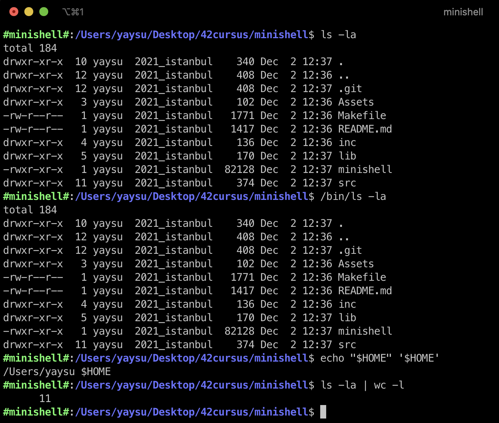

# minishell

**Score: 100/100**

This project is about making a command interpreter (shell) based on bash.

## Features

- Built-in commands: `cd` `pwd` `echo` `export` `unset` `env` `exit`
- Signal handling: `CTRL-C` `CTRL-\` `CTRL-D` (not quite signal but...)
- Pipes `|`
- Redirections `>` `<` `>>` `<<`
- Local variables
- Environment expansions and exit status `$?`
- Quotes `'` `"`

## How It Works

The program has 4 main sections: **`Splitter`** -> **`Lexer`** -> **`Parser`** -> **`Executor`**

Let's say our example input is `ls -la | wc -l`

In **`Splitter`** we are dividing input into meaningful parts and store those in a string array (2D char array).
```
ls
-la
|
wc
-l
```

In **`Lexer`** we are looking at the meaningful parts and determine their type.
```
ls = COMMAND
-la = ARGUMENT
| = PIPE
wc = COMMAND
-l = ARGUMENT
```

In **`Parser`** we are creating command blocks.
```
{
  cmd = ls
  args = [-la]
  in = stdin
  out = pipe
}
{
  cmd = wc
  args = [-l]
  in = pipe
  out = stdout
}
```

In **`Executor`** we are simply executing the command blocks.

## Usage

Just use `make readline` to get the readline lib, than use `make` to get the executable `minishell` program.

If you encounter a readline problem when compiling with `make` first use `make readline` then use `make`. This should solve the problem.

After compiling it run it like `./minishell`.


